# Continuous Model Training with VESSL and Jenkins CI
-----
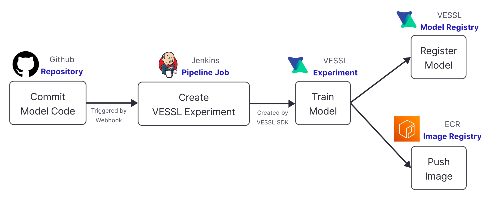

Jenkins는 인기있는 오픈소스 CI/CD 툴입니다. 이 가이드는 Jenkins와 VESSL을 통합하여 머신러닝 실험을 자동으로 실행하고 실험의 결과로 생성된 모델을 모델 레지스트리에 등록하는 파이프라인을 보여줍니다.

## Workflow
1. Git repository에 코드가 푸시됩니다.
1. Jenkins는 Git repository에서 코드를 가져와 VESSL SDK로 실험을 생성합니다.
1. VESSL에 연동된 클러스터에서 실험을 실행하고 결과를 생성합니다.
1. 실험 결과가 생성되면 VESSL SDK를 사용하여 실험 결과를 VESSL 모델 저장소에 등록하거나, 모델이 포함된 머신러닝 추론용 컨테이너 이미지를 생성하여 이미지 저장소에 저장합니다.
1. 생성된 모델 혹은 이미지가 모델 레지스트리 혹은 컨테이너 레지스트리에 등록되면 파이프라인이 완료됩니다.
   - 이 가이드에서는 실험 결과로 생성된 모델을 VESSL 모델 레지스트리에 등록합니다.

## Setup
1. Install Jenkins Plugin for Git SCM\
   `Jenkins Dashboard` > `Manage Jenkins` > `Plugin Manager` 메뉴에서 사용할 Git 서비스에 맞는 플러그인을 설치합니다.
   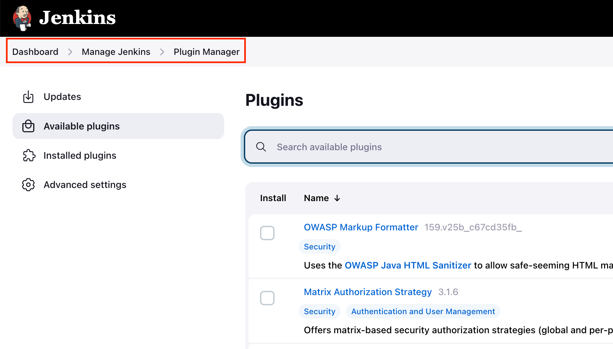
   - Github: https://plugins.jenkins.io/github/
   - Bitbucket: https://plugins.jenkins.io/bitbucket/

1. Get VESSL API Token
   1. 터미널에서, `vessl configure` 명령어로 CLI에 로그인합니다.
   1. `$HOME/.vessl/config` 파일에서 `access_token` 을 복사합니다.

1. Generate GitHub/Bitbucket service Token\
   Jenkins가 git repository에 접근할 수 있도록 token을 발급받습니다. 아래를 참고하여, repository와 webhook에 접근할 수 있도록 권한을 조정합니다.
   - Github: https://github.com/settings/tokens
     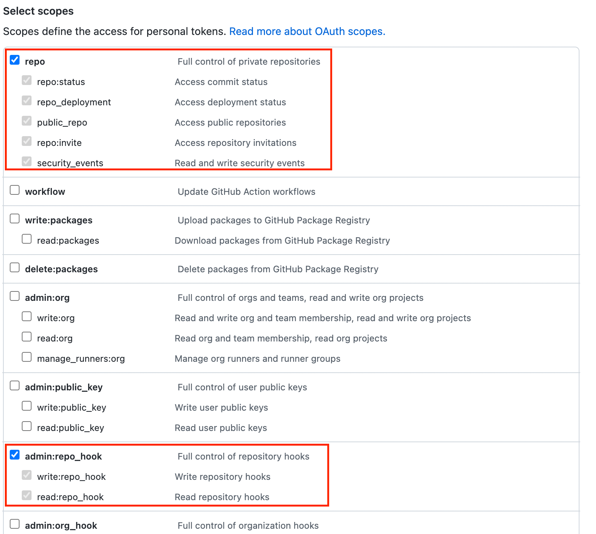
   - Bitbucket: https://bitbucket.org/account/settings/app-passwords/
     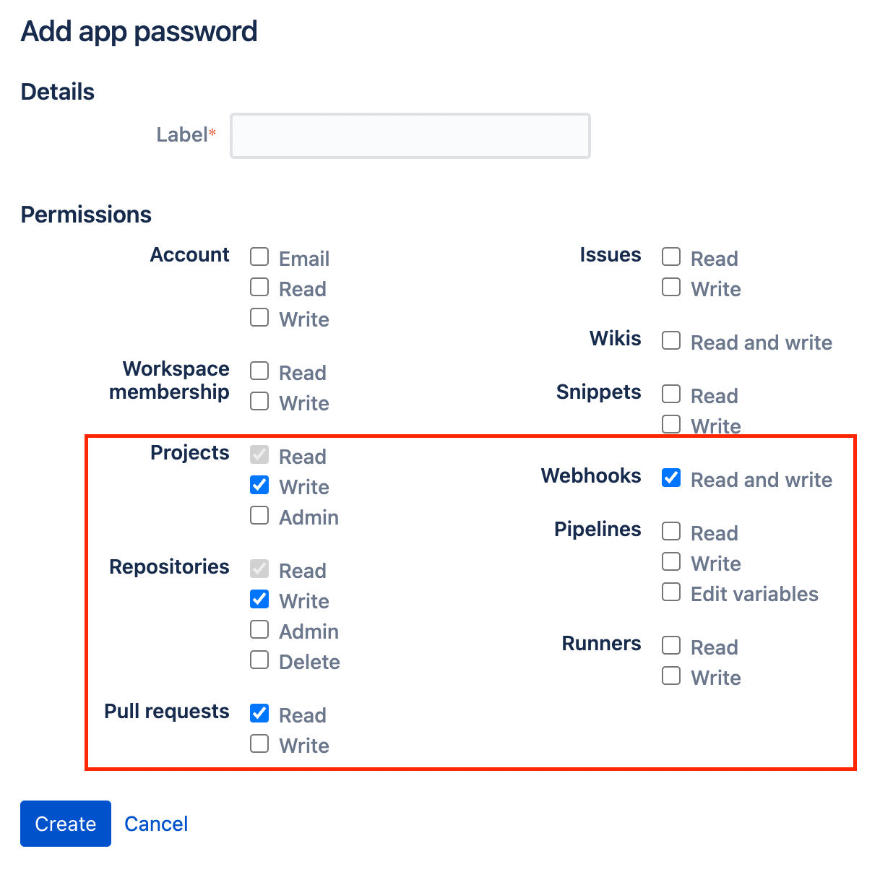
   
1. Configure Credentials\
   위 두 과정에서 발행한 토큰을 Jenkins에 등록합니다.
   1. `Stores scoped to Jenkins` 섹션에서 (global) scope를 선택해 Jenkins Dashboard > Manage Jenkins > Manage Credentials > System > Global credentials (unrestricted) 메뉴로 이동합니다.
   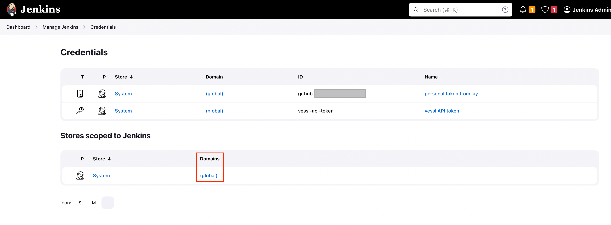
   1. VESSL API token을 등록합니다.
      - Kind: Secret text
      - Secret: 위에서 획득한 `access_token` 의 값을 넣습니다.
      - ID: `vessl-api-token`
      - Description: 알아볼 수 있는 적절한 설명을 적습니다.
   1. Git credential을 등록합니다.
      - Kind: Username with password
      - Username: Git 서비스의 사용자 이름
      - Password: 위에서 획득한 Git SCM token의 값을 넣습니다.
      - ID: `git-repository-credential`
      - Description: 알아볼 수 있는 적절한 설명을 적습니다.
   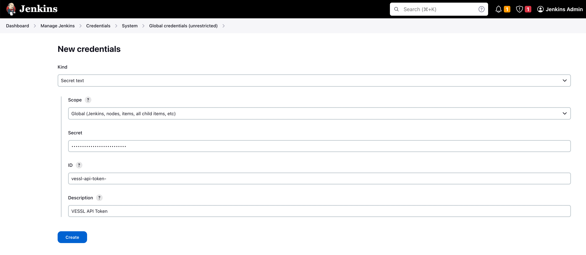

1. Setup Jenkins Pipeline\
   git repository에서 코드를 가져와 실행할 파이프라인을 정의합니다.\
   1. Jenkins의 메인 화면에서 "New Item"을 누른 후, Pipeline을 선택합니다.
      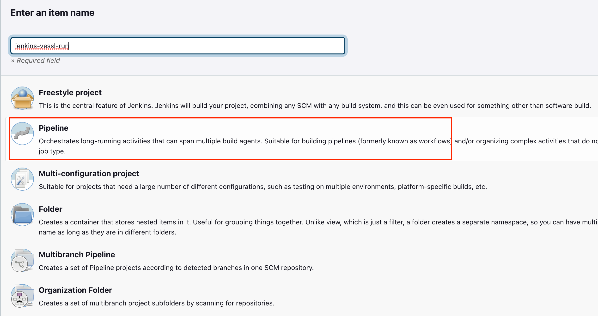
   1. 설정 화면의 "Build Triggers" 항목에서 사용하는 Git 서비스에 따라 build trigger를 설정합니다.
      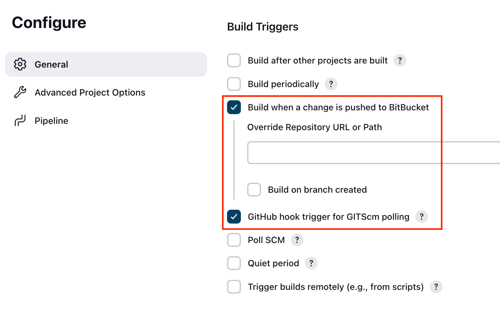
   1. 설정 화면의 "Pipeline" 항목에서 pipeline의 정의를 설정합니다.
      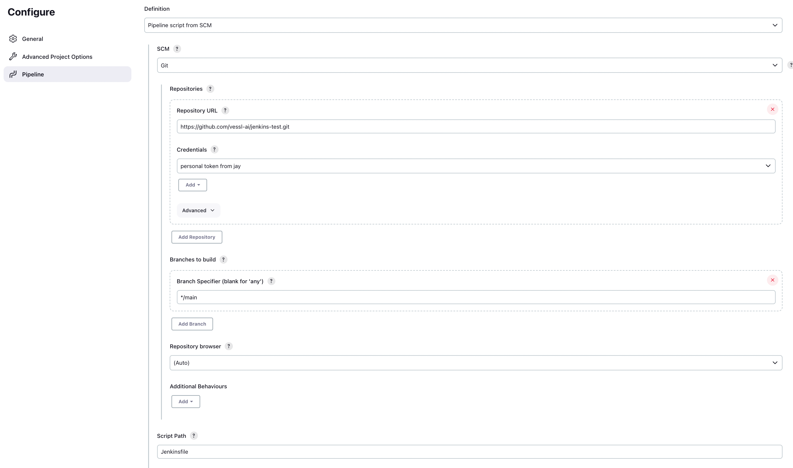
      - "Pipeline script from SCM"을 선택합니다.
      - "SCM"을 "Git"로 선택합니다.
      - "Repository URL"에 git repository의 URL을 입력합니다.
      - "Credentials"에 위에서 등록한 Git credential을 선택합니다.
      - "Script Path"에 Jenkinsfile의 경로를 입력합니다.
      - "Branch Specifier"에 파이프라인을 작동시킬 branch를 입력합니다.
      
1. Setup Webhook trigger\
   파이프라인을 설정할 git repository의 webhook을 설정합니다.
   - GitHub: `{JENKINS_URL}/github-webhook/` 으로 push event가 가게 설정합니다.
   - BitBucket: `{JENKINS_URL}/bitbucket-hook/` 으로 push event가 가게 설정합니다.
   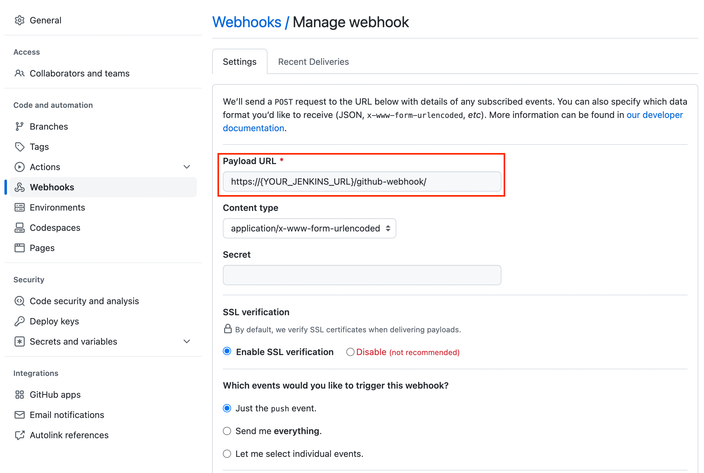

## Run Pipeline
모든 설정이 완료되면 파이프라인을 직접 실행할 수 있습니다.\
Jenkinsfile의 git URL 등 설정을 사용하시는 repository에 맞게 바꾼 후, 위의 파이프라인에서 설정한 "Branch Specifier"에 해당하는 브랜치로 모델 코드의 업데이트를 push하면, webhook을 통해 Jenkins job이 실행됩니다.

Jenkins job에서는 experiment를 생성하고, 실험 결과로 생성된 모델을 VESSL 모델 레지스트리에 등록할 수 있습니다.
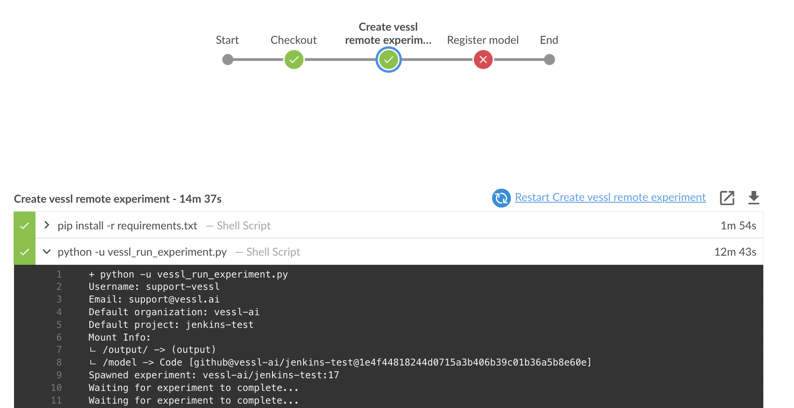

VESSL에서는 Jenkins Pipeline을 통해 생성된 실험과 모델을 대시보드를 통해 쉽게 조회하고, 결과를 비교할 수 있습니다.
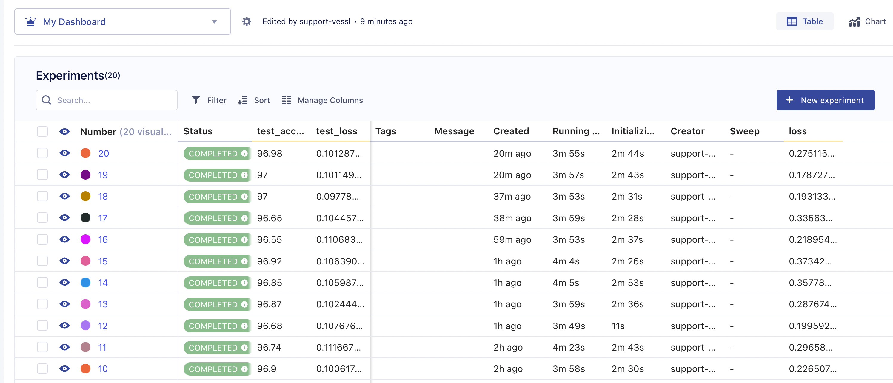

> **🚧 Caveats**
>
> - 하나의 파이프라인에서 학습과 모델 등록을 진행하는 가이드를 제공드리기 위해, 예시의 파이프라인에서는 실험이 끝날때까지 기다리는 동작이 추가되어 있습니다. 실제 환경에서는 학습에 매우 많은 시간이 소요되기 때문에, 학습과 모델 등록을 별도의 파이프라인으로 분리하는 것을 권장합니다.
> - 학습이 완료되고 artifact가 업로드된 후, 학습 스크립트에서 외부의 API를 직접 호출하는 방식으로 학습의 다음 과정을 트리거할 수 있습니다. 추후, VESSL experiment의 생성/성공/실패시 outbound webhook을 VESSL control plane에서 직접 전송하는 기능이 제공될 예정입니다.
